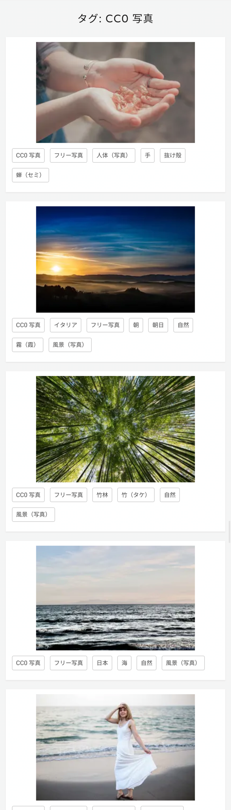
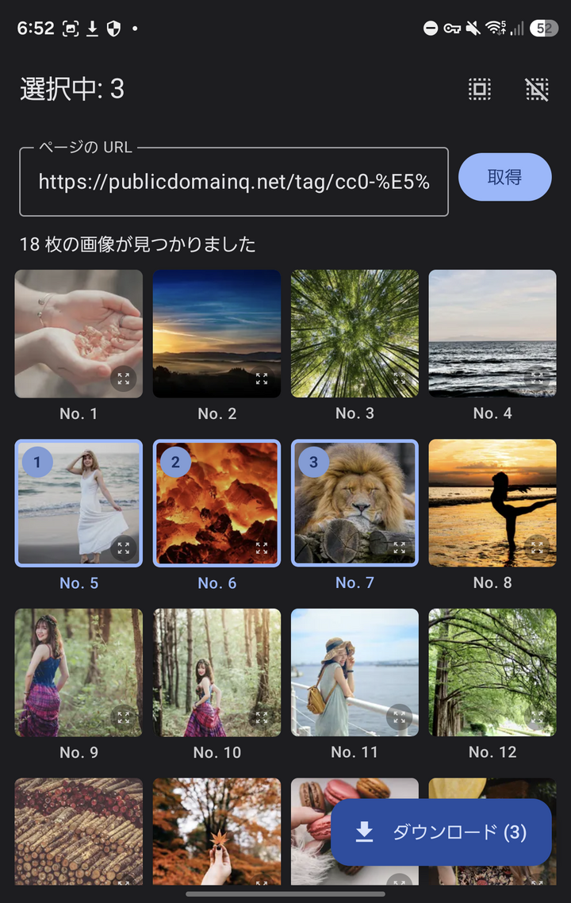
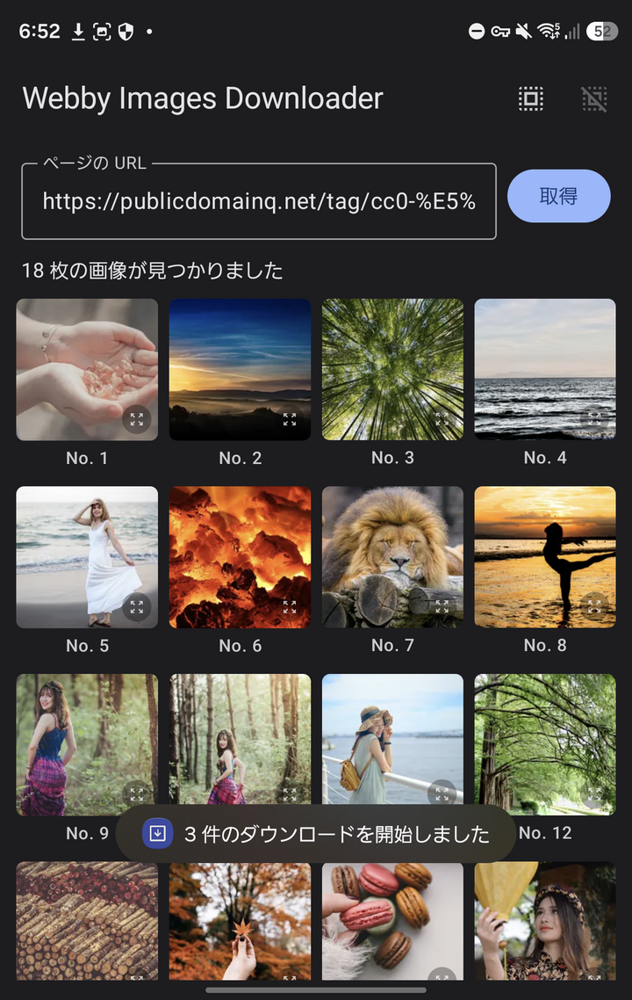
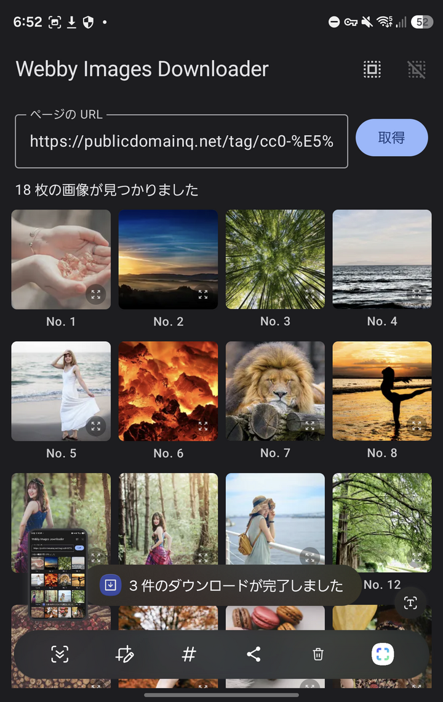
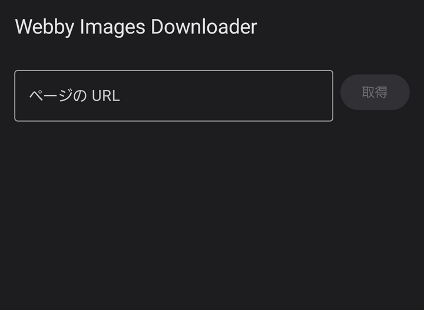

# Webby Images Downloader

An Android app that lists the images on a web page, lets you pick the ones you want by tapping, and downloads them all at once.

Share a page URL to the app from your browser (or paste it in), tap the images you want, tap **Download**, and they land in your Downloads folder.

> The app's UI is currently in Japanese only.

## How it works

Take a web page with a bunch of images on it. This one is a [CC0 photo tag page on publicdomainq.net](https://publicdomainq.net/tag/cc0-%E5%86%99%E7%9C%9F/):

<p align="center">
  
</p>

Share its URL to Webby Images Downloader, or paste it into the URL field and tap **取得** (Fetch). The app collects every image on the page and shows them in a grid, numbered in the order they appear on the page. Tap the ones you want; each gets a badge showing its selection order:

<p align="center">
  
</p>

Tap **ダウンロード** (Download). The images are handed to Android's download manager, so they keep downloading even if you leave the app:

<p align="center">
  
</p>

When the batch finishes you get a notification and a toast:

<p align="center">
  
</p>

And the files are in `Download/WebbyImagesDownloader/`, with their original file names:

<p align="center">
  
  
  
</p>

If you open the app from the launcher instead of sharing a URL to it, you get an empty screen with just the URL field:

<p align="center">
  
</p>

### Built-in viewer

Every thumbnail has a small button in its corner that opens the image full-screen. The viewer starts out with nothing but the image:

<p align="center">
  
</p>

A single tap shows the position in the page and the image URL:

<p align="center">
  
</p>

Gestures in the viewer:

- Swipe left / right to move between images (at 1x zoom)
- Pinch to zoom, drag to pan while zoomed in
- Double-tap to toggle between 1x and zoomed in
- Double-tap and hold, then drag down to zoom in or up to zoom out

## Features

- Receives a URL via the Android share sheet (`ACTION_SEND`, `text/plain`), or takes one pasted into the URL field
- Collects images from the page with [jsoup](https://jsoup.org/): `` (including lazy-load attributes like `data-src`), the largest candidate of each `srcset`, `<picture>` sources, and `og:image` / `twitter:image` meta tags
- Shows the images in a grid, numbered in page order, with select-all / clear-selection buttons
- Downloads selected images in one batch through `DownloadManager`
- Posts a notification and a toast when the batch finishes, including how many failed, if any
- Sends the page URL as `Referer` when loading thumbnails and downloading, so sites with hotlink protection still work
- Full-screen viewer with pinch, pan, double-tap, and quick-scale gestures
- Light and dark theme

## Requirements

- Android 8.0 (API 26) or later
- On Android 13+, the app asks for notification permission the first time you download, so it can tell you when the batch is done

## Where the files go

Images are saved to `Download/WebbyImagesDownloader/` on shared storage, keeping the original file name from the URL.
If the URL has no file extension, `.jpg` is appended.

## Development

Built without Android Studio, from the command line (WSL works fine).

### Requirements

- JDK 17
- Android SDK with platform 36 and build-tools 36.0.0
    - `ANDROID_HOME` set, or `sdk.dir` in `local.properties`

### Build

```bash
./gradlew :app:assembleDebug
```

The APK is written to `app/build/outputs/apk/debug/app-debug.apk`.

Debug builds use a separate application id (`.debug` suffix), an orange app bar and icon, and "(debug)" in the app name, so they can be installed alongside a release build.

### Install

```bash
adb install -r app/build/outputs/apk/debug/app-debug.apk
```

### Release build

```bash
./gradlew :app:assembleRelease
```

Release builds have R8 minification and resource shrinking enabled. The output is unsigned; sign it with `apksigner` before installing.

## Tech stack

- Kotlin, Jetpack Compose (Material 3)
- [jsoup](https://jsoup.org/) for HTML parsing
- [Coil](https://coil-kt.github.io/coil/) with OkHttp for thumbnails
- Android `DownloadManager` for downloads

## License

[MIT](LICENSE)

## Special thanks

- [publicdomainq.net](https://publicdomainq.net/tag/cc0-%E5%86%99%E7%9C%9F/) for the CC0 photos used in the screenshots above
